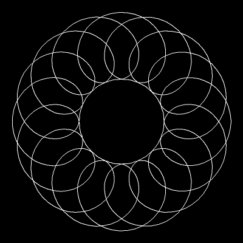

# ttfrm #

[![CircleCI Status Shield][shield_circleci]][build_circleci]
[![Coveralls Status Shield][shield_coveralls]][build_coveralls]
[![Code Size Shield][shield_code_size]][ref_floppy_disk]
[![License Shield][shield_license]][file_license_md]

3D Rigid Transforms in C++ with frame checking. Ttfrm is built on top of Eigen.
It's implemented with quaternions instead of matrices, if you happen to care
about those sort of things.

Frame checking means that you can't accidentally mix up your transforms. Well
you can, but Ttfrm will helpfully crash your program. At least I think it's
helpful. Maybe it's best to see an example:

```cpp
const quat rot = {0.7071, 0.0, -0.7071, 0.0};
const vec3 trans = {1.0, 1.0, 1.0};

// Transform to X from World
const tfrm<std::string> x_from_world(to_s("x") << from_s("world"), rot, trans);

// Transform to Y from X
const tfrm<std::string> y_from_x(to_s("y") << from_s("x"), rot, trans);

// Transform to Z from Y
const tfrm<std::string> z_from_y(to_s("z") << from_s("y"), rot, trans);

// Compose transforms to get the transform to Z form World (?)
const tfrm<std::string> z_from_world = z_from_y * x_from_world;

// ...Oops, forgot the transform to Y from X!
```

The above code will crash with the following exception:

```text
terminate called after throwing an instance of 'ttfrm::compose_exception'
  what():  Cannot compose transforms ([z] << [y]) and ([x] << [world])
Aborted (core dumped)
```

The programmer can then go and fix the error!

```cpp
// We found the bug and everything is good this time!
const tfrm<std::string> z_from_world = z_from_y * y_from_x * x_from_world;
```

## Building ##

The build uses Meson and Ninja. You will need to install those. On Ubuntu you
can probably run something like:

```text
$ sudo apt-get install python3-pip ninja-build
$ sudo pip3 install meson
```

You may optionally install dependencies for Eigen3, GTest, and SDL2. (GTest and
SDL2 are only used for tests and demos.) If you don't install them, Meson
should automatically download the dependencies for you.

```text
# This is optional, Meson can download dependencies
$ sudo apt-get install libeigen3-dev libfmt-dev libgtest-dev libsdl2-dev
```

Once the dependencies are in place, we can run the build:

```text
$ meson setup build
$ ninja -C build
```

## Testing ##

Run the tests using the following commands:

```text
$ meson setup build
$ ninja -C build
$ ./build/tfrm_test
$ ./build/tfrm_tree_test
```

## Benchmarking ##

Run the benchmarks using the following commands:

```text
$ meson setup build
$ ninja -C build
$ ./build/tfrm_bench
```

## Chaining Transforms ##

Transforms can be composed using a multiplication-like operator. So you can
write compositions like this:

```cpp
// Here's a good way to name your transforms!
const auto z_from_world = z_from_x * x_from_y * y_from_world;
```

I recommend the naming convention `target_from_source`, because it's easier to
visually check that the transform chain is correct. When frames match up
lexicographically, it indicates that they also match up in the transform chain,
e.g., `_x * x_` and `_y * y_`.

Compare this to the `source_to_target` naming convention:

```cpp
// Here's a not-so-good way to name your transforms!
const auto world_to_z = x_to_z * y_to_x * world_to_y;
```

## Poses As Transforms ##

The relationship between poses and transforms can be somewhat confusing. I
think that's because they're essentially two different names for the same
thing. A pose contains a rotation and translation relative to some frame,
exactly like a transform. If we want to transform a pose, we can do that by
treating the pose as a transform. To transform the pose, we just compose the
transform and the pose-like transform.

We typically use language like "Pose A in the World Frame." If we treat the
pose as a transform, we would instead say something like "Transform to the
World Frame from Frame A". Does that seem backwards? Consider that Pose A is at
the origin of Frame A. To get Pose A in the World Frame, we must transform the
origin of Frame A to the World Frame, which looks something like this:

```cpp
const auto pose_a_in_world = world_from_a * origin_in_a;
```

Of course, transforming the origin is completely unnecessary, and we can just
use an alias:

```cpp
const auto& pose_a_in_world = world_from_a;
```

If you only have the inverse, you could use that too:

```cpp
const auto pose_a_in_world = a_from_world.inverse();
```

## Why Quaternions? ##

Quaternions take up less memory than rotation matrices:

``` text
///////////////////////
// MEMORY USAGE INFO //
///////////////////////

Sizes of ttfrm types:
  sizeof(ttfrm::quat) = 32
  sizeof(ttfrm::vec3) = 24
  sizeof(ttfrm::tfrm<int>) = 80
  sizeof(ttfrm::tfrm<std::uint8_t>) = 80
  sizeof(ttfrm::tfrm<std::sting>) = 128
  sizeof(ttfrm::tfrm<(Empty Struct)>) = 80
Sizes of Eigen types:
  sizeof(Eigen::Matrix3d) = 72
  sizeof(Eigen::Vector3d) = 24
  sizeof(Eigen::Matrix4d) = 128
  sizeof(Eigen::Isometry3d) = 128
Memory usage summary:
  ttfrm::tfrm<int> IS SMALLER THAN Eigen::Isometry3d
    (You save 48 B per transform, 46.875 KiB for every 1000 transforms)
  ttfrm::tfrm<std::string> IS THE SAME SIZE AS Eigen::Isometry3d
```

They are also faster to interpolate, which is nice for robotics:

```text
////////////////////
// CPU USAGE INFO //
////////////////////

Running ttfrm::tfrm<int> benchmarks over 100M iterations... Done!
Running Eigen::Isometry3d benchmarks over 100M iterations... Done!

CPU usage summary:
  ttfrm::tfrm<int> benchmarks:
    Apply:   Took 1.677 s (16 ns average)
    Compose: Took 2.081 s (20 ns average)
    Inverse: Took 1.827 s (18 ns average)
    Interp:  Took 1.651 s (16 ns average)
  Eigen::Isometry3d benchmarks:
    Apply:   Took 0.611 s (6 ns average)
    Compose: Took 1.444 s (14 ns average)
    Inverse: Took 1.594 s (15 ns average)
    Interp:  Took 4.609 s (46 ns average)
```

You might also expect composition to be faster with quaternions, but I'm
guessing Eigen's `Isometry3d` is so well optimized it's actually faster!

## Demo ##

In the `tests` directory there is a simple 2D Spirograph-like demo. It works by
composing several parameterized, circular transforms. You can run it using the
following commands:

```text
$ meson setup build
$ ninja -C build
$ ./build/spirograph_demo
```

<p align="center">

</p>

<!-- Links -->

[build_circleci]: https://circleci.com/gh/tprk77/ttfrm
[build_coveralls]: https://coveralls.io/github/tprk77/ttfrm
[file_license_md]: https://github.com/tprk77/ttfrm/blob/master/LICENSE.md
[ref_floppy_disk]: https://en.wikipedia.org/wiki/History_of_the_floppy_disk
[shield_circleci]: https://img.shields.io/circleci/build/gh/tprk77/ttfrm/master
[shield_code_size]: https://img.shields.io/github/languages/code-size/tprk77/ttfrm
[shield_coveralls]: https://img.shields.io/coveralls/github/tprk77/ttfrm
[shield_license]: https://img.shields.io/github/license/tprk77/ttfrm?color=informational

<!-- Local Variables: -->
<!-- fill-column: 79 -->
<!-- End: -->
